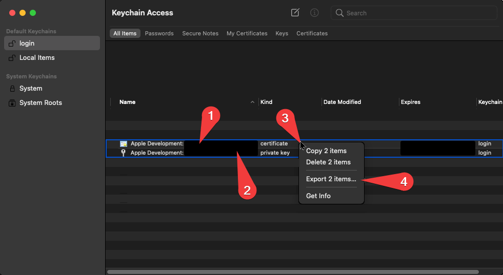

# Frequently Asked Questions (F.A.Q.)

- ### How do you export the certificate and key?

  On your Mac, open the `Keychain` app. There you will find your certificate (1) and private key (2). Select them by holding `Command`, then right-click (3) and select `Export 2 items...` (4). This will export you the `.p12` file you need.

  

- ### How can I debug a failing builder?

  Edit the `sign.sh` file in your builder's repo and remove the output suppression from the failing line. Usually this will be the `xresign.sh` call, so:

  ```bash
  ./xresign.sh ...  >/dev/null 2>&1
  ```

  Becomes:

  ```bash
  ./xresign.sh ...
  ```

  Next time you run a build, the logs will give you full details that you can use to resolve your issue. The reason that the output suppression is there in the first place is to prevent leaks of potentially sensitive information about your certificates and apps.

- ### What kind of certificates/provisioning profiles are supported?

  Technically, everything is supported as long as your iOS device trusts it. This includes free signing profiles, but of course, they expire after a week. The only major difference between signing profiles is based on the provisioning profile's `application-identifier`. There are two types:

  - Wildcard, with app id = `TEAM_ID.*`

    - Can properly sign any app (`TEAM_ID.app1`, `TEAM_ID.app2`, ...)
    - Can't use special entitlements such as app groups (Apple restriction)

  - Explicit, with app id = `TEAM_ID.app1`
    - Can properly sign only one app (`TEAM_ID.app1`)
    - Can use any entitlement as long as it's in the provisioning profile
    - If you properly sign multiple apps with the same profile, only one of the apps can be installed on your device at a time. This is because their bundle ids will be identical and the apps will replace each other.
    - It is possible to improperly sign apps with an explicit profile by keeping their original bundle ids even if they don't match the profile's app id. For an example, with an app id `TEAM_ID.app1`, you could sign the apps `TEAM_ID.app2` and `TEAM_ID.app3`. This way, you can have multiple apps installed at the same time, and they will run, but all of their entitlements will be broken, including file importing.

- ### App runs, but malfunctions due to invalid signing/entitlements

  First, make sure you are signing the app correctly and not breaking the entitlements. Read the section just above.

  If that doesn't help, you need to figure out what entitlements the app requires. unc0ver 6.0.2 and DolphiniOS emulator need the app debugging (`get-task-allow`) entitlement. Make sure you are using a signing profile with `get-task-allow=true` in its provisioning profile. Also, when you upload such an app to this service, make sure to tick the `Enable app debugging` option. Since this is a potential security issue, it will be disabled by default unless you tick the box.

- ### "This app cannot be installed because its integrity could not be verified."

  This error means that the signing process went terribly wrong. To debug the problem, install [libimobiledevice](https://libimobiledevice.org/) (for Windows: [imobiledevice-net](https://github.com/libimobiledevice-win32/imobiledevice-net)). Download the problematic signed app from your service to your computer, and then attempt to install it on your iOS device:

  ```bash
  ideviceinstaller -i app.ipa
  ```

  You can also use `-u YOUR_UDID -n` to run this command over the network. When the installation finishes, you should see a more detailed error. Please create an issue here on GitHub and upload the unsigned app along with the detailed error from above so this can be fixed.
